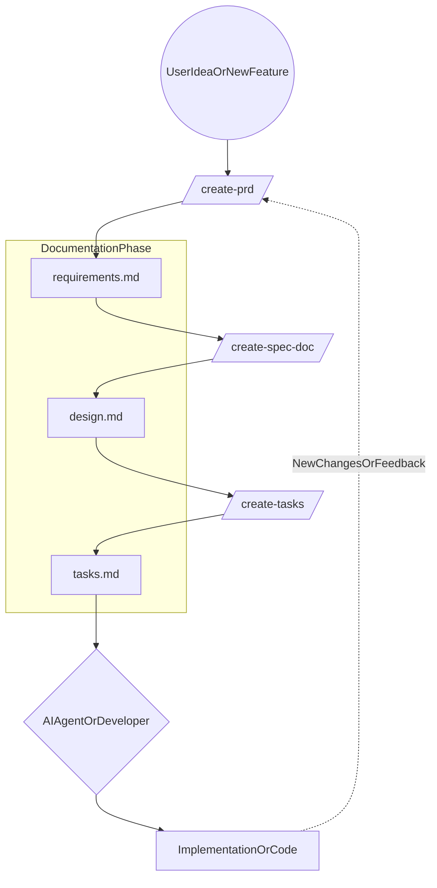

# my-cursor-settings

> Traditional Chinese: [`README.zh-TW.md`](README.zh-TW.md)

Version-controlled Cursor skills for a Spec-Driven Development (SDD) workflow.

This repo is intended for **team use**: it standardizes how we write and
incrementally update requirements, design specs, and implementation tasks so
they stay aligned with code over time.

## What you get

- **SDD workflow** with three phases and three documents (English source of
  truth under `docs/en/`).
- **Reusable Cursor skills**:
  - `/create-prd` → requirements (PRD)
  - `/create-spec-doc` → design/spec
  - `/create-tasks` → task breakdown
  - `/translate-sdd-docs-zh-tw` → zh-TW translation of docs (manual)
- **Incremental update support** for brownfield projects (delta analysis,
  merge, tagging).

## Workflow at a glance

Canonical output targets (English):

- Requirements/PRD: `docs/en/requirements.md`
- Design/Spec: `docs/en/design.md`
- Tasks: `docs/en/tasks.md`

Typical usage:

1. **Requirements**: run `/create-prd` to create or update
   `docs/en/requirements.md`.
2. **Design**: run `/create-spec-doc` to create or update `docs/en/design.md`.
3. **Tasks**: run `/create-tasks` to create or append to `docs/en/tasks.md`.
4. **Implement**: pick tasks and implement; keep docs and code in sync.

## Workflow diagram example



## PRD vs Spec boundary (authoritative)

We enforce a strict boundary between product requirements (what/why) and
technical specification (how).

The canonical boundary template is:

- `skills/create-prd/references/prd_spec_boundary_template.md`

Key rules:

- **PRD owns**: goals, user stories, capabilities, scope, acceptance criteria,
  risks/assumptions, and product-level non-functional expectations.
- **Spec owns**: architecture, data contracts, API/payload/error codes, module
  layout, runtime config, retries/idempotency, and test plans.
- **Do not mix**: PRD must not include file paths, function/class names, DB
  table/field mappings, endpoints, or payload schemas.

## Skills

### `/create-prd` (Requirements)

- **Output**: `docs/en/requirements.md`
- **Style**:
  - User stories are outcome-oriented.
  - Functional requirements and exception flows use EARS-style sentences:
    - `The system shall...`
    - `When..., the system shall...`
    - `If..., then the system shall...`
- **Brownfield updates**:
  - Scan for an existing PRD (canonical path first, then legacy names).
  - Perform delta analysis and merge changes into the existing structure.
  - Tag new items with `[NEW]` and keep IDs stable (`FR-*`, `EX-*`, `AC-*`).

### `/create-spec-doc` (Design)

- **Output**: `docs/en/design.md`
- **Core behavior**:
  - Performs impact analysis (blast radius) for changes.
  - Merges updates into relevant sections instead of rewriting everything.
  - Marks updated items with `[MODIFIED]` (and `[NEW]` when helpful).
- **Traceability**:
  - In-scope `FR-*`, `EX-*`, `AC-*` must be referenced in the spec (or
    explicitly marked out-of-scope).

### `/create-tasks` (Tasks)

- **Output**: `docs/en/tasks.md`
- **Append-only rule**:
  - Never overwrite existing tasks in brownfield.
  - Append `## [Feature Name] Implementation` sections to preserve history.
- **Task quality**:
  - Atomic (one focused coding session).
  - Each task includes a short traceability hint to the design sections and,
    when available, PRD requirement IDs.

## Installation (symlink into `~/.cursor/skills/`)

This repo is designed to be installed via symlink so Cursor can discover the
skills.

Use the helper script:

- `scripts/symlink_skills_to_cursor.sh`

Recommended:

```bash
./scripts/symlink_skills_to_cursor.sh --dry-run --merge
./scripts/symlink_skills_to_cursor.sh --merge --force
```

Notes:

- `--merge` symlinks each skill folder into `~/.cursor/skills/` without
  removing other skills you already have.
- `--force` replaces conflicting existing entries under `~/.cursor/skills/`.

## Translation (Traditional Chinese)

English docs under `docs/en/` are the source of truth.

To produce Traditional Chinese versions under `docs/zh-TW/`, run:

- `/translate-sdd-docs-zh-tw`

Translation rules:

- Preserve IDs and tags exactly (`FR-*`, `EX-*`, `AC-*`, `T-*`, `[NEW]`,
  `[MODIFIED]`).
- Do not translate inline code/backticks or code fences.

## Project maintenance guideline

### Golden rule: update docs before code

In this SDD workflow, avoid "code first, docs later." That pattern quickly
breaks AI-assisted consistency and traceability.

When adding or changing a feature, keep this order:

1. Run `/create-prd` to confirm product logic and acceptance boundaries.
2. Run `/create-spec-doc` to confirm the technical implementation path.
3. Run `/create-tasks` to confirm execution steps and scope.
4. Only then ask AI agents/developers to implement based on new tasks.

By following this sequence, `requirements.md` and `design.md` remain living
system history documents that help new engineers (and future AI sessions)
understand the system quickly.

## Repo structure

```text
rules/
skills/
  create-prd/
  create-spec-doc/
  create-tasks/
  translate-sdd-docs-zh-tw/
scripts/
```

### `rules/` (User-scope rules, version-controlled)

The `rules/` directory is used to **store and version-control commonly used
User Rules** (user-scope rules) as a shared reference for the team.

How we use it:

- These files are **not** automatically loaded by Cursor.
- Treat them as a curated library of rule texts the team can copy into
  Cursor **User Rules** (or adapt into project rules under `.cursor/rules/`
  in a specific codebase when needed).
- Keep each rule focused and reusable (avoid project-specific assumptions).

Recommended contents:

- Language/communication preferences (e.g., reply language)
- Documentation standards (e.g., English-only docstrings/comments)
- PRD/Spec boundary guidance that should apply across many repos
- Git commit message conventions and review checklists

## Conventions

- **IDs are stable**: do not renumber `FR-*`, `EX-*`, `AC-*` once published.
- **Incremental updates**: prefer scan → analyze → merge over rewriting.
- **Doc/code sync**: when code changes affect behavior, update the docs first
  (or in the same change) to keep SDD consistent.

## Roadmap

- Add a Traditional Chinese README after the English README is finalized.
