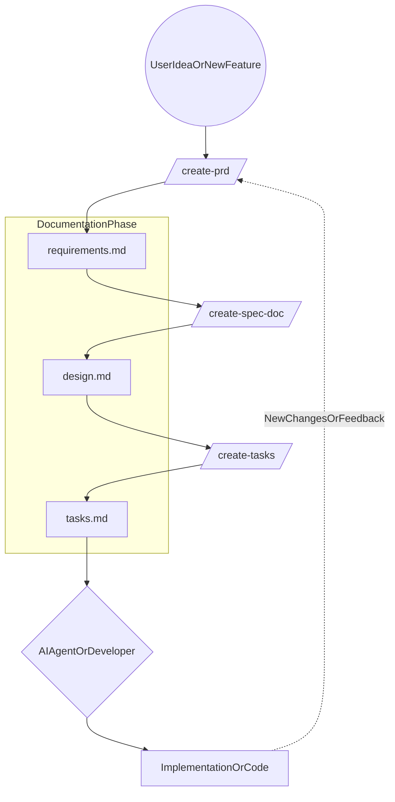

# my-cursor-settings

> English: [`README.md`](README.md)

這個 repo 用來版控一套 Cursor skills，以實作 Spec-Driven Development (SDD)
工作流。

這份 README 以**團隊共用**為目標：我們希望需求、設計規格與任務拆解能以一致
的方式撰寫並支援增量更新，長期維持與程式碼同步。

## 你會得到什麼

- **SDD 工作流**：三個階段、三份文件（預設輸出到 `docs/en/`）。
- **可重用的 Cursor skills**：
  - `/create-prd` → 需求（PRD）
  - `/create-spec-doc` → 設計/規格（Spec）
  - `/create-tasks` → 任務拆解（Tasks）
  - `/translate-sdd-docs-zh-tw` → 產生文件的繁中版本（手動觸發）
- **支援既有專案的增量更新**：差異分析、合併更新、標籤註記。

## 工作流總覽

英文版（canonical）預設輸出位置：

- Requirements/PRD：`docs/en/requirements.md`
- Design/Spec：`docs/en/design.md`
- Tasks：`docs/en/tasks.md`

典型使用順序：

1. **Requirements**：執行 `/create-prd` 建立或更新
   `docs/en/requirements.md`
2. **Design**：執行 `/create-spec-doc` 建立或更新 `docs/en/design.md`
3. **Tasks**：執行 `/create-tasks` 建立或追加到 `docs/en/tasks.md`
4. **Implement**：依 tasks 實作，並保持文件與程式碼同步

## 工作流程圖例示範



## PRD vs Spec 邊界（權威規範）

我們嚴格區分產品需求（what/why）與技術規格（how）。

權威邊界模板：

- `skills/create-prd/references/prd_spec_boundary_template.md`

核心規則：

- **PRD 負責**：目標、User Stories、能力與範圍、驗收標準、風險/假設、產品
  層級非功能性需求。
- **Spec 負責**：架構、資料契約、API/payload/error codes、模組切分、執行
  期設定、重試/idempotency、測試與驗證計畫。
- **不可混用**：PRD 不得包含檔案路徑、function/class 名稱、DB
  table/field 映射、endpoint、payload schema 等實作細節。

## Skills

### `/create-prd`（Requirements）

- **輸出**：`docs/en/requirements.md`
- **風格**：
  - User stories 以「角色/能力/結果」為主。
  - Functional requirements 與 exception flows 採用 EARS 句型：
    - `The system shall...`
    - `When..., the system shall...`
    - `If..., then the system shall...`
- **既有專案更新（brownfield）**：
  - 先掃描是否已存在 PRD（先 canonical path，再掃 legacy 檔名）。
  - 做 delta analysis，將變更合併進既有結構。
  - 新增項目以 `[NEW]` 標記，並保持 IDs 穩定（`FR-*`, `EX-*`, `AC-*`）。

### `/create-spec-doc`（Design）

- **輸出**：`docs/en/design.md`
- **核心行為**：
  - 對變更做 impact analysis（blast radius）。
  - 將更新合併到對應章節，而非整份重寫。
  - 對更新項目標記 `[MODIFIED]`（必要時也可用 `[NEW]`）。
- **可追蹤性**：
  - 在 scope 內的 `FR-*`, `EX-*`, `AC-*` 需要在 spec 中被引用，或明確標示
    out-of-scope。

### `/create-tasks`（Tasks）

- **輸出**：`docs/en/tasks.md`
- **只追加（append-only）**：
  - 既有專案不得覆蓋舊任務。
  - 以 `## [Feature Name] Implementation` 章節追加新功能任務，保留歷史與進度。
- **任務品質**：
  - 原子化（單一 coding session 可完成）。
  - 每個 task 需附上設計章節引用，並在可用時附上 PRD IDs。

## 安裝（symlink 到 `~/.cursor/skills/`）

這個 repo 設計成使用 symlink 安裝，讓 Cursor 能自動發現 skills。

使用 helper script：

- `scripts/symlink_skills_to_cursor.sh`

建議用法：

```bash
./scripts/symlink_skills_to_cursor.sh --dry-run --merge
./scripts/symlink_skills_to_cursor.sh --merge --force
```

說明：

- `--merge`：逐個 skill 建立 symlink，不會移除你原本的其他 skills。
- `--force`：遇到同名衝突時，用 symlink 取代既有項目。

## 翻譯（繁體中文）

英文文件（`docs/en/`）是 source of truth。

若要產出 `docs/zh-TW/` 下的繁中版本，執行：

- `/translate-sdd-docs-zh-tw`

翻譯規則：

- 必須完整保留 IDs 與 tags（`FR-*`, `EX-*`, `AC-*`, `T-*`, `[NEW]`,
  `[MODIFIED]`）。
- 不翻譯 inline code（反引號）與 code fences。

## 專案維護指引

### 黃金律：先修文件，再改程式碼

在這套 SDD 工作流中，最應避免的是「先改 code、再補文件」。
這樣很容易破壞 AI 協作的一致性與可追蹤性。

新增或調整功能時，請固定遵守以下順序：

1. 執行 `/create-prd`，先確認產品邏輯與驗收邊界。
2. 執行 `/create-spec-doc`，確認技術實作路徑。
3. 執行 `/create-tasks`，確認執行步驟與範圍。
4. 最後才依新增任務請 AI agent／工程師進行實作。

維持這個順序後，`requirements.md` 與 `design.md` 才會持續是活的系統歷史，
讓新進工程師（或未來的 AI）能快速掌握專案全貌。

## Repo 結構

```text
rules/
skills/
  create-prd/
  create-spec-doc/
  create-tasks/
  translate-sdd-docs-zh-tw/
scripts/
```

### `rules/`（User scope rules，版控用）

`rules/` 目錄用來**存放並版控常用的 User Rules**，作為團隊共用的規則文字庫。

使用方式：

- 這些檔案**不會**被 Cursor 自動載入。
- 團隊成員可將內容複製到 Cursor 的 **User Rules**，或在特定專案中視需要改寫成
  `.cursor/rules/` 的 project rules。
- 規則應保持可重用與聚焦，避免包含特定專案假設。

建議內容類型：

- 語言/溝通偏好（例如回覆語言）
- 文件/程式碼註解標準（例如註解與 docstring 全英文）
- PRD/Spec 邊界準則（可跨 repo 共用）
- commit message 規範與 review checklist

## 慣例

- **IDs 固定**：一旦發佈，不要重編 `FR-*`, `EX-*`, `AC-*`。
- **增量更新優先**：以 scan → analyze → merge 取代整份重寫。
- **文件與程式碼同步**：行為變更時，先更新文件（或至少同一個變更一起更新）。

## Roadmap

- 英文版 README 確認無誤後，維持本繁中版本與英文版章節同步更新。

